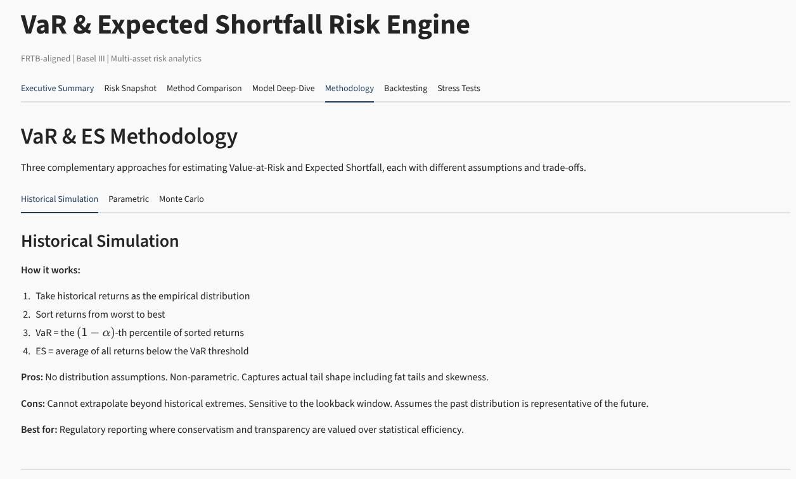
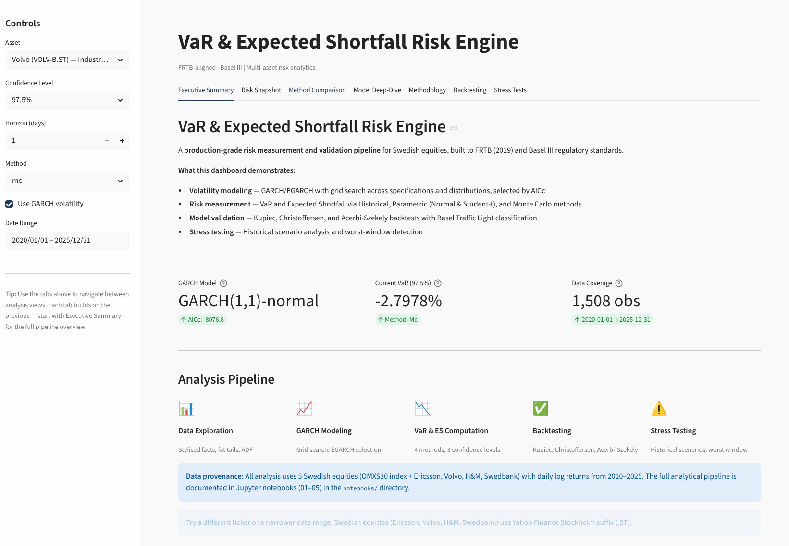
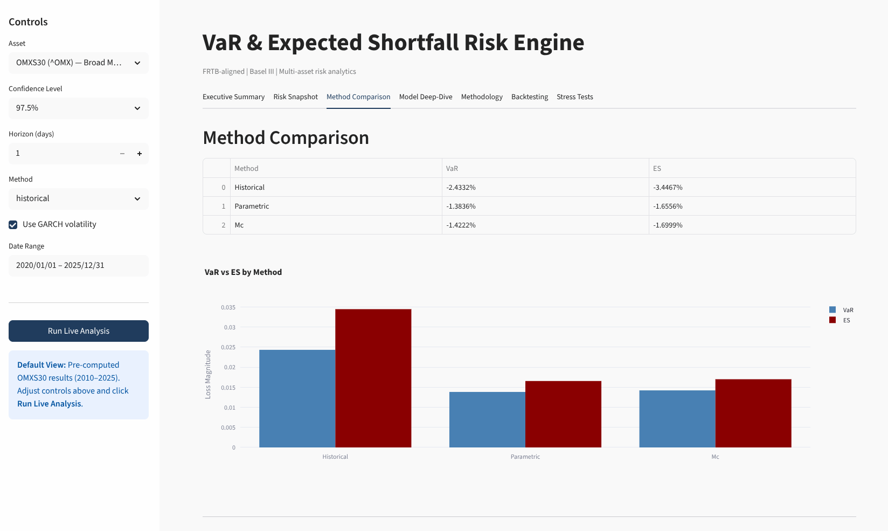
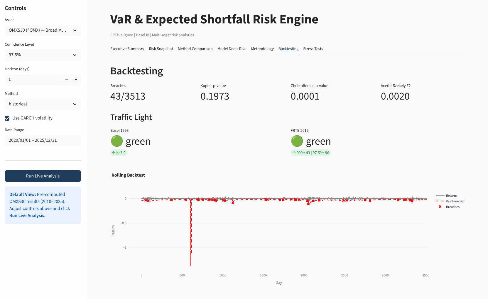
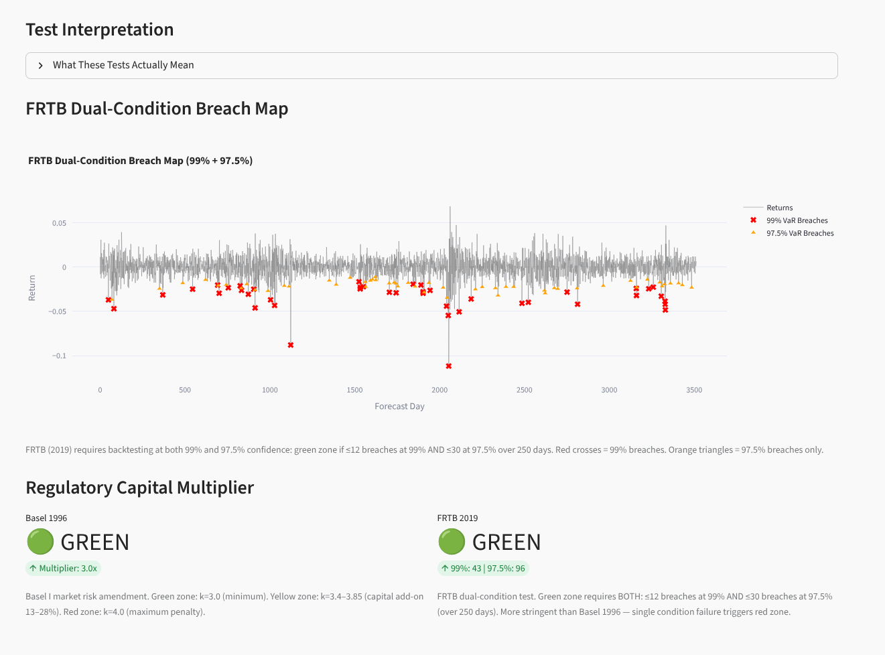
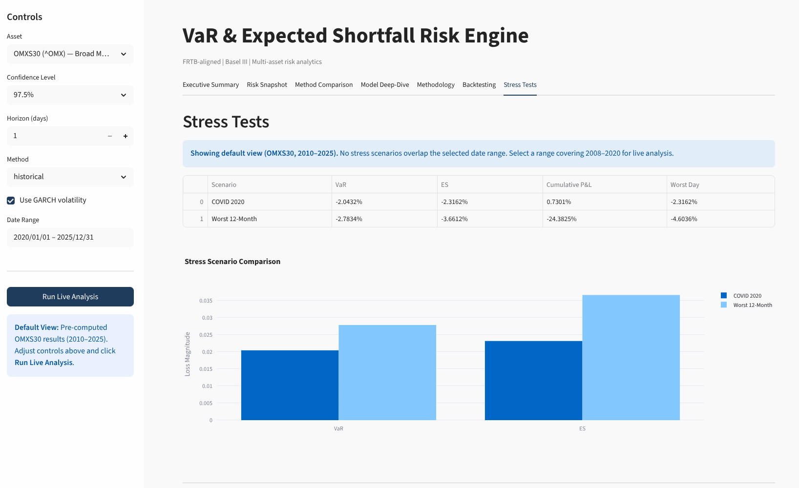
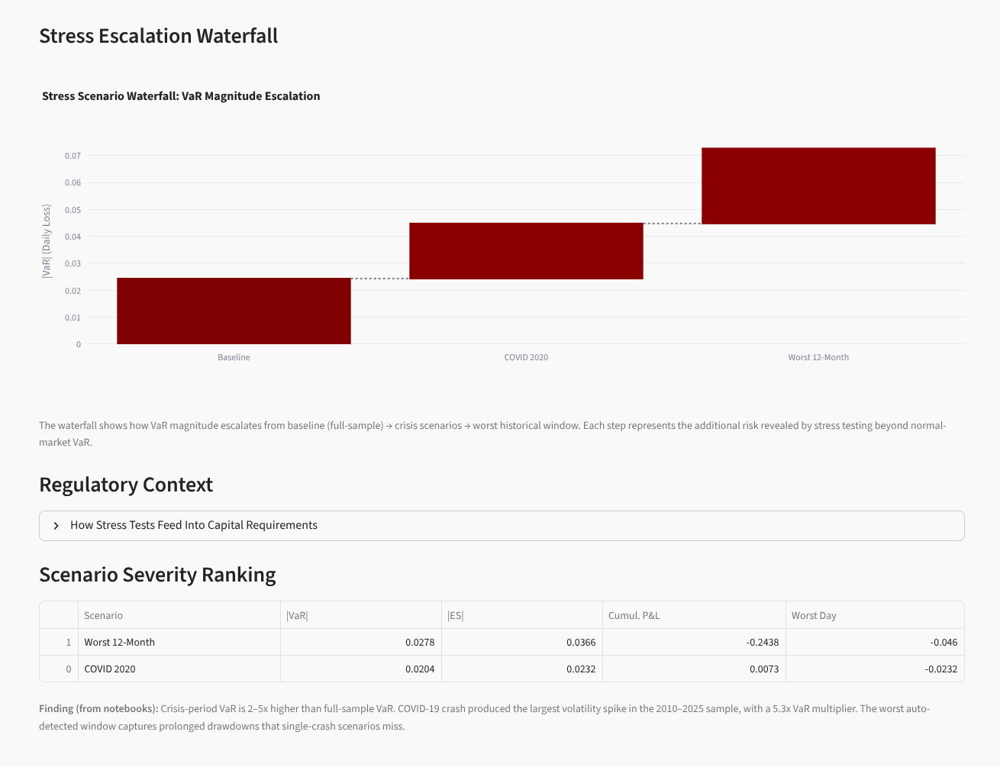
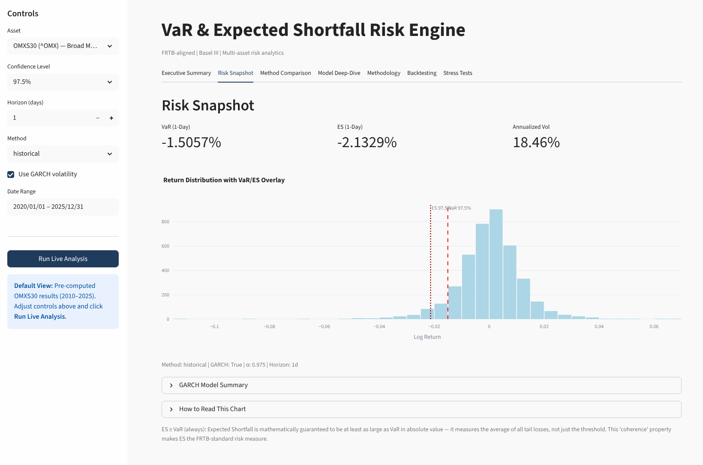

# VaR & Expected Shortfall Engine

[](https://www.python.org/)
[](https://github.com/)
[](LICENSE)
[](https://streamlit.io/)

A multi-asset risk engine that computes Value at Risk (VaR) via three methods (Historical, Parametric, Monte Carlo) alongside Expected Shortfall (ES), backed by GARCH volatility modeling and regulatory backtesting against Basel Committee standards.

## Executive summary

This project is a market risk engine built to the standards expected of a Risk Analyst role at a Nordic bank or consulting firm. It covers the full pipeline: data, volatility modeling, risk measurement, backtesting, and an interactive dashboard.

**What it does:**
- Computes VaR at any confidence level with three methods
- Computes Expected Shortfall — the coherent risk measure mandated by FRTB
- Models time-varying volatility with GARCH(1,1) and EGARCH, selected by grid search
- Backtests VaR forecasts with Kupiec (1995) and Christoffersen (1998) tests
- Classifies model performance under the Basel traffic light system
- Runs historical stress scenarios (COVID 2020 crash, worst 12-month window) and sensitivity shocks
- Wraps everything in a Streamlit dashboard for interactive exploration

**Regulatory context:** Under Basel III's Fundamental Review of the Trading Book (FRTB, BCBS 2019), Expected Shortfall at 97.5% confidence replaces VaR at 99% as the primary risk measure for market risk capital. This engine frames all outputs against that regulatory standard.

## Key concepts

### VaR (Value at Risk)

The loss that will not be exceeded with probability $1 - \alpha$ over a holding period $h$:


$$
\mathrm{VaR}_\alpha = \inf\,\{\,l \in \mathbb{R} : P(L > l) \leq 1 - \alpha\,\}
$$


### Expected Shortfall (ES / CVaR)

The mean loss conditional on exceeding VaR:


$$
\mathrm{ES}_\alpha = \mathbb{E}[L \mid L > \mathrm{VaR}_\alpha]
$$


### Why ES replaces VaR

VaR is **not a coherent risk measure**. It fails the subadditivity axiom (Artzner et al., 1999): diversification can *increase* measured VaR, a perverse outcome for a risk manager. ES satisfies all four coherence axioms: monotonicity, subadditivity, positive homogeneity, and translational invariance. FRTB mandates ES at 97.5% for this reason.

### Basel traffic light system

A supervisory backtesting framework. Over a 250-trading-day window:

| Breaches | Zone | Multiplier |
|----------|------|------------|
| 0–4 | Green | 3.0 |
| 5–9 | Yellow | 3.40–3.85 |
| >=10 | Red | 4.0 |

The multiplier scales a bank's market risk capital requirement. A red zone triggers automatic capital add-ons and regulatory scrutiny.

## Methodology



The engine follows four stages: volatility modeling, risk measurement, backtesting, and stress testing.

### Stage 1: GARCH volatility modeling (`src/garch.py`)

Conditional volatility is modeled via GARCH(1,1):


$$
\sigma_t^2 = \omega + \alpha \varepsilon_{t-1}^2 + \beta \sigma_{t-1}^2
$$


where $\sigma_t^2$ is conditional variance, $\varepsilon_{t-1}$ is the previous period's innovation, and $\omega, \alpha, \beta$ are estimated by maximum likelihood.

The module supports:
- **GARCH and EGARCH** — EGARCH captures the leverage effect (negative returns increase volatility more than positive returns of equal size). The EGARCH(1,1) specification:

  
$$
\ln\sigma_t^2 = \omega + \alpha\left|\frac{\varepsilon_{t-1}}{\sigma_{t-1}}\right| + \gamma\frac{\varepsilon_{t-1}}{\sigma_{t-1}} + \beta\ln\sigma_{t-1}^2
$$


  where $\gamma < 0$ indicates the leverage effect: negative shocks raise volatility more than positive ones.
- **Normal and Student-t error distributions** — the t-distribution handles fat tails better. The degrees of freedom parameter controls tail heaviness; lower df = fatter tails.
- **Grid search** via `fit_garch_grid()` — tries all combinations of (p,q), vol model, and distribution, selecting by AICc:

  
$$
\mathrm{AICc} = \mathrm{AIC} + \frac{2k(k+1)}{n-k-1}
$$


  where $k$ is the number of parameters and $n$ the sample size. AICc penalizes complexity more than AIC in small samples, guarding against overfitting the volatility dynamics.
- **Multi-asset fitting** — one GARCH model per asset for portfolio use

Core functions: `fit_garch()`, `fit_garch_grid()`, `forecast_vol()`

### Stage 2: VaR calculation (`src/var_methods.py`)

Three methods behind a single `compute_var_es()` interface:

**Historical simulation**

$$
\mathrm{VaR}_\alpha = \mathrm{Percentile}\bigl(\{ r_t \}_{t=1}^T,\; 1-\alpha\bigr)
$$


The empirical quantile of sorted historical returns. No distributional assumption. When GARCH conditional volatility is available, each historical return is scaled by the ratio $\sigma_t^{\mathrm{GARCH}} / \sigma^{\mathrm{hist}}$. This adjusts historical returns to reflect current market conditions. Without GARCH scaling, a calm historical period can produce VaR estimates that are dangerously low when volatility spikes.

Non-parametric and captures the empirical tail shape. Slow to react to regime changes and sensitive to window length.

**Parametric (variance-covariance)**

$$
\mathrm{VaR}_\alpha = \mu + \sigma \cdot z_\alpha
$$


where $z_{\alpha}$ is the standard Normal (or Student-t) quantile. With GARCH, $\sigma$ is the conditional volatility from the fitted model rather than the unconditional standard deviation.


$$
\mathrm{ES}_\alpha = \mu - \frac{\phi(z_\alpha)}{1-\alpha} \cdot \sigma \quad \text{(Normal)}
$$


where $\phi$ is the standard Normal PDF.

Computationally trivial and analytically tractable. Underestimates risk if tails are fatter than the assumed distribution.

**Monte Carlo simulation**
Simulates return paths via Geometric Brownian Motion:


$$
S_T = S_0 \cdot \exp\left[(\mu - \tfrac{1}{2}\sigma^2)T + \sigma\sqrt{T} \cdot Z\right], \quad Z \sim \mathcal{N}(0,1)
$$


Uses **antithetic variates** for variance reduction: each random draw $Z$ is paired with $-Z$, forcing the empirical mean of the sample to exactly 0 and halving the Monte Carlo standard error for a given number of paths. GARCH conditional volatility replaces the constant $\sigma$ when available, making simulated paths responsive to current market conditions. The $\alpha$-quantile of simulated terminal returns gives VaR; ES is the mean of returns below that quantile.

Captures non-linearity and works for any payoff structure. Heavier to compute and sensitive to GBM assumptions (constant drift, continuous paths, Normal innovations).

**Portfolio VaR** (`compute_portfolio_var_es()`) aggregates weighted asset returns and applies the chosen method to the portfolio-level series.

### Stage 3: Backtesting (`src/backtest.py`)

**Kupiec POF test (1995)**
A likelihood ratio test of whether observed breach frequency matches the expected rate $1-\alpha$:


$$
LR_{\mathrm{POF}} = -2\ln\left(\frac{(1-\alpha)^x\,\alpha^{\,T-x}}{(x/T)^x\,(1-x/T)^{T-x}}\right) \;\sim\; \chi^2_{(1)}
$$


Null hypothesis: the breach rate equals $1-\alpha$. Rejection means the VaR model is miscalibrated.

**Christoffersen conditional coverage test (1998)**
Extends Kupiec by testing whether breaches are independent (not clustered). Models the breach sequence as a first-order Markov chain with transition probabilities $\pi_{ij} = P(I_t = j \mid I_{t-1} = i)$:


$$
LR_{\mathrm{Ind}} = -2\ln\left(\frac{(1-\pi)^{n_{00}+n_{10}}\,\pi^{n_{01}+n_{11}}}{(1-\pi_0)^{n_{00}}\,\pi_0^{n_{01}}\,(1-\pi_1)^{n_{10}}\,\pi_1^{n_{11}}}\right) \;\sim\; \chi^2_{(1)}
$$


where $\pi_0 = n_{01}/(n_{00}+n_{01})$ and $\pi_1 = n_{11}/(n_{10}+n_{11})$ are the conditional breach probabilities, and $\pi = (n_{01}+n_{11})/n$ is the unconditional rate. Large $LR_{\mathrm{Ind}}$ means yesterday's breach predicts today's breach.

The full conditional coverage test combines both:


$$
LR_{\mathrm{CC}} = LR_{\mathrm{POF}} + LR_{\mathrm{Ind}} \;\sim\; \chi^2_{(2)}
$$


Breaches that cluster during crisis periods signal that the model does not adapt to volatility regimes, a problem for regulatory approval.

**Acerbi-Szekely Z2 test (2014)**
A direct backtest for Expected Shortfall. Unlike Kupiec and Christoffersen which only test VaR breach frequency, the Z2 statistic measures whether realized returns on breach days are consistent with the ES forecast:


$$
Z_2 = \frac{1}{n}\sum_{t=1}^n \frac{R_t}{\mathrm{ES}_t} \cdot \mathbf{1}_{\{ R_t \leq \mathrm{VaR}_t \}} + 1
$$


Under the null of correctly specified ES, $\mathbb{E}[Z_2] = (1-\alpha) + 1$ (e.g., 1.01 at 99% confidence): the expected return on a breach day, expressed as a fraction of ES, should equal 1. If $Z_2$ is significantly below its expected value, ES forecasts are too optimistic (underestimating tail loss). If above, ES is too conservative.

P-values are computed by Monte Carlo simulation: breach days are randomly reshuffled under the null, and the distribution of Z2 under no timing skill is compared to the observed value.

**Basel traffic light** (`traffic_light()`)
Implements both the Basel II (1996) and FRTB (2019) traffic light frameworks for supervisory backtest evaluation. Basel II (1996) uses a 250-day window with a multiplier-based penalty system. FRTB (2019) uses separate 99% VaR and 97.5% ES thresholds.

### Stage 4: Stress testing (`src/stress_test.py`)

Historical scenario replay and sensitivity analysis:
- `run_historical_scenario()` — computes VaR/ES over predefined stress periods (COVID 2020 crash)
- `find_worst_window()` — finds the worst rolling return window in the dataset
- `sensitivity_shocks()` — applies user-defined factor shocks to asset returns

## Dashboard

**Live:** [var-es-risk-engine.streamlit.app](https://var-es-risk-engine.streamlit.app/)



The Streamlit dashboard provides interactive exploration of all four pipeline stages across seven tabs.

### Method Comparison



Historical, Parametric, and Monte Carlo VaR/ES side-by-side at the selected confidence level, with distribution fit analysis and confidence level sensitivity.

### Backtesting





Rolling backtest with Kupiec POF, Christoffersen conditional coverage, and Acerbi-Szekely Z2 tests. FRTB dual-condition breach map and Basel traffic light classification updated per window.

### Stress Tests





Historical scenario replay (COVID 2020 crash, worst auto-detected window) with stress escalation waterfall and severity ranking.

## Results



Rolling backtest on OMXS30 (Swedish large-cap index): 2-year expanding window, 250 biweekly-step out-of-sample forecasts, GARCH(1,1) refit per window. Basel II (1996) traffic light applied at 99% VaR over 250 trading days. Results from `notebooks/04_backtesting.ipynb`:

| Method | VaR 95% | VaR 99% | ES 97.5% | Breaches (250d) | Traffic Light | Kupiec p-value |
|--------|---------|---------|----------|-----------------|:---:|----------------|
| Historical (unconditional) | -1.84% | -3.11% | -3.24% | 4 | Green | 0.3843 |
| Parametric (Student-t) | -1.73% | -3.00% | -3.19% | 4 | Green | 0.3843 |
| Historical (GARCH-scaled) | -1.68% | -2.83% | -2.95% | 5 | Yellow | 0.1640 |
| Monte Carlo (GBM) | -1.73% | -2.46% | -2.46% | 8 | Yellow | 0.0056 |
| Parametric (Normal) | -1.69% | -2.40% | -2.41% | 9 | Yellow | 0.0014 |

**What stands out:**
- Two methods achieve Green zone: Historical unconditional and Parametric Student-t, both with 4 breaches (p > 0.05)
- Parametric Normal is rejected (p < 0.01): the Normal distribution cannot capture the fat tails in OMXS30 returns
- GARCH scaling alone is not enough: Historical GARCH-scaled sits at 5 breaches (Yellow) despite better volatility conditioning
- Student-t parametric balances the best of both: fat-tailed distribution with GARCH conditional volatility

## Project structure

```
var-es/
├── src/                    # Risk engine core
│   ├── garch.py            # GARCH/EGARCH fitting, grid search, forecasting
│   ├── var_methods.py      # Historical, Parametric, MC VaR + ES + Portfolio
│   ├── backtest.py         # Kupiec, Christoffersen, Acerbi-Szekely, traffic light
│   ├── stress_test.py      # Historical scenarios, worst-window, sensitivity shocks
│   ├── utils.py            # Return computation, yfinance data fetching
│   └── exceptions.py       # Custom exception classes
├── app/                    # Streamlit dashboard
│   ├── streamlit_app.py    # Multi-tab interactive dashboard
│   └── charts.py           # Chart rendering functions
├── notebooks/              # Educational walkthrough
│   ├── 01_data_exploration.ipynb
│   ├── 02_garch_volatility.ipynb
│   ├── 03_var_methods.ipynb
│   ├── 04_backtesting.ipynb
│   └── 05_stress_testing.ipynb
├── tests/                  # pytest test suite (49 tests)
│   ├── test_garch.py
│   ├── test_var_methods.py
│   ├── test_backtest.py
│   ├── test_stress_test.py
│   ├── test_utils.py
│   ├── test_integration.py
│   └── conftest.py
├── data/                   # Asset price data (parquet)
├── img/                    # Dashboard screenshots
├── requirements.txt
└── LICENSE
```

## Installation

Python 3.10+.

```bash
git clone <repo-url>
cd var-es
pip install -r requirements.txt
streamlit run app/streamlit_app.py
```

The dashboard opens at `http://localhost:8501`.

## Notebooks

Five Jupyter notebooks walk through the risk modeling pipeline from data to backtesting. Each combines code, charts, and explanatory context:

1. **01_data_exploration.ipynb** — Price data, return distributions, stylized facts (fat tails, volatility clustering)
2. **02_garch_volatility.ipynb** — GARCH(1,1) and EGARCH fitting, model selection by AICc, conditional volatility plots
3. **03_var_methods.ipynb** — Historical, Parametric, and Monte Carlo VaR and ES, side-by-side comparison
4. **04_backtesting.ipynb** — Kupiec POF, Christoffersen conditional coverage, Acerbi-Szekely ES test, traffic light
5. **05_stress_testing.ipynb** — COVID 2020 crash, worst-window analysis, sensitivity shocks

To run them: `jupyter notebook` and open any file in `notebooks/`.

## Testing

49 tests, 80% line coverage:

```bash
pytest --cov=src --cov-report=term-missing
```

Tests cover all three VaR methods, GARCH fitting, backtest statistics, stress scenarios, data utilities, and integration paths.

## References

- Artzner, P., Delbaen, F., Eber, J.-M., & Heath, D. (1999). "Coherent Measures of Risk." Mathematical Finance, 9(3), 203–228.
- Kupiec, P. (1995). "Techniques for Verifying the Accuracy of Risk Measurement Models." Journal of Derivatives, 3(2), 73–84.
- Christoffersen, P. (1998). "Evaluating Interval Forecasts." International Economic Review, 39(4), 841–862.
- Acerbi, C. & Szekely, B. (2014). "Backtesting Expected Shortfall." Risk Magazine, 27(11), 76–81.
- BCBS (2019). "Minimum Capital Requirements for Market Risk." [d457.pdf](https://www.bis.org/bcbs/publ/d457.pdf)
- Jorion, P. (2007). *Value at Risk* (3rd ed.). McGraw-Hill.
- McNeil, A. J., Frey, R., & Embrechts, P. (2015). *Quantitative Risk Management* (2nd ed.). Princeton University Press.
- Engle, R. F. (1982). "Autoregressive Conditional Heteroscedasticity with Estimates of the Variance of United Kingdom Inflation." Econometrica, 50(4), 987–1007.
